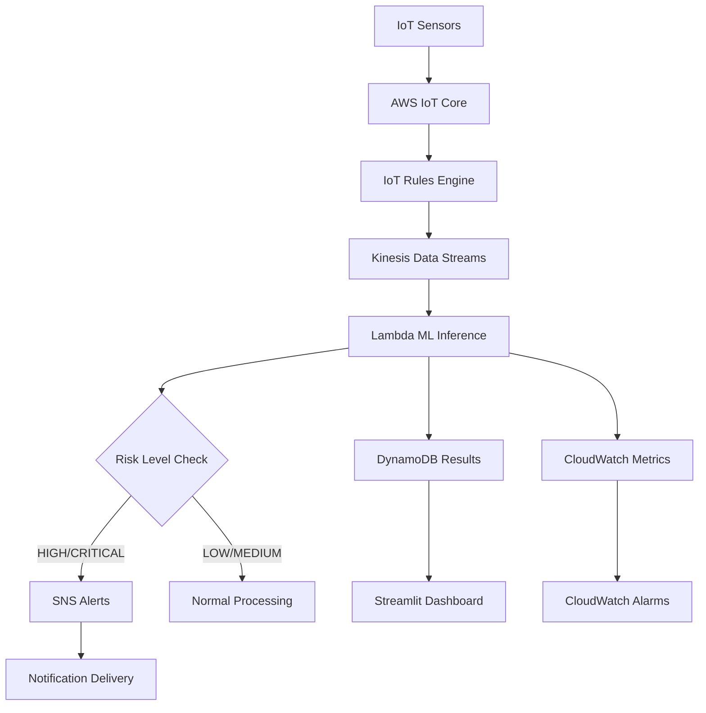
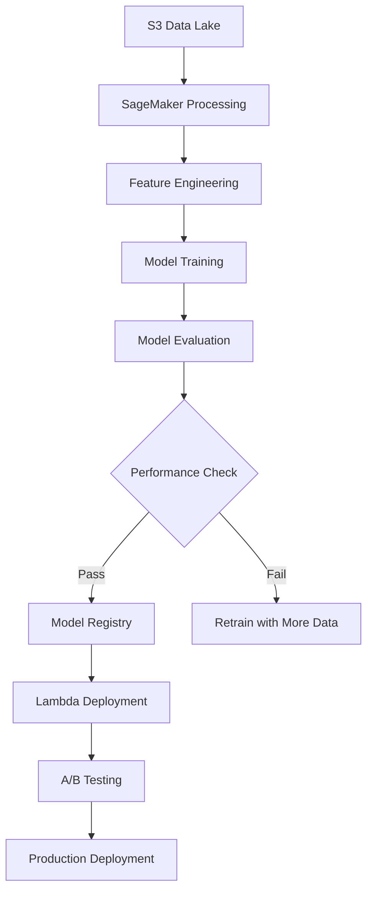
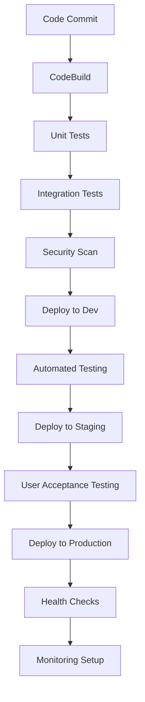

# Water Leak Detection System - Design Document

## 1. System Architecture Overview

### 1.1 High-Level Architecture

The Water Leak Detection System follows a cloud-native, microservices architecture built on AWS services, providing real-time monitoring, ML-based prediction, and comprehensive alerting for any type of facility or infrastructure.

```
┌─────────────────────────────────────────────────────────────────────────────┐
│                        Water Leak Detection System                          │
├─────────────────────────────────────────────────────────────────────────────┤
│                                                                             │
│  ┌─────────────────┐    ┌──────────────┐    ┌─────────────────┐            │
│  │   IoT Sensors   │───▶│  AWS IoT     │───▶│   Kinesis       │            │
│  │   (Any          │    │  Core        │    │   Streams       │            │
│  │   Facility)     │    │              │    │                 │            │
│  └─────────────────┘    └──────────────┘    └─────────────────┘            │
│                                                       │                     │
│  ┌─────────────────┐    ┌──────────────┐    ┌─────────────────┐            │
│  │   CloudWatch    │◀───│   Lambda     │◀───│   Real-time     │            │
│  │   Monitoring    │    │   ML         │    │   Processing    │            │
│  │                 │    │   Inference  │    │                 │            │
│  └─────────────────┘    └──────────────┘    └─────────────────┘            │
│           │                       │                                         │
│           ▼                       ▼                                         │
│  ┌─────────────────┐    ┌──────────────┐    ┌─────────────────┐            │
│  │   SNS Alerts    │    │  DynamoDB    │    │   Streamlit     │            │
│  │   (Maintenance  │    │  Results     │    │   Dashboard     │            │
│  │   Staff)        │    │  Storage     │    │                 │            │
│  └─────────────────┘    └──────────────┘    └─────────────────┘            │
│                                                                             │
└─────────────────────────────────────────────────────────────────────────────┘
```

### 1.2 Architecture Principles

- **Cloud-Native**: Built on AWS services for scalability and reliability
- **Real-Time Processing**: Sub-5-second latency for critical facility environments
- **Microservices**: Loosely coupled components for maintainability
- **Event-Driven**: Asynchronous processing using message queues and events
- **Facility-Agnostic**: Zone-based prioritization adaptable to any facility type

## 2. Component Design

### 2.1 Data Ingestion Layer

#### 2.1.1 IoT Sensor Integration
```python
# Sensor Data Schema
{
    "sensor_id": "S001",
    "timestamp": "2026-01-25T10:30:00Z",
    "location": "Server Room A",
    "facility_zone": "CRITICAL",
    "measurements": {
        "pressure_bar": 3.2,
        "flow_rate_lps": 125.5,
        "temperature_c": 18.5
    },
    "device_metadata": {
        "battery_level": 85,
        "signal_strength": -45,
        "last_calibration": "2026-01-20T09:00:00Z"
    }
}
```

#### 2.1.2 AWS IoT Core Configuration
- **Thing Types**: WaterLeakSensor with standardized attributes
- **Device Certificates**: X.509 certificates for secure authentication
- **IoT Rules**: Route sensor data to Kinesis streams based on facility zones
- **Device Shadow**: Maintain sensor state and configuration

### 2.2 Stream Processing Layer

#### 2.2.1 Amazon Kinesis Data Streams
```yaml
Stream Configuration:
  Name: water-leak-sensor-data
  Shards: 2 (scalable based on throughput)
  Retention: 24 hours
  Partitioning: By facility_zone for parallel processing
```

#### 2.2.2 Data Flow Design
```
Sensor Data → IoT Core → Kinesis → Lambda → [ML Processing] → DynamoDB
                                         ↓
                                   CloudWatch Metrics
                                         ↓
                                   SNS Notifications
```

### 2.3 Machine Learning Layer

#### 2.3.1 ML Pipeline Architecture

```python
class MLPipeline:
    """
    Multi-model ML pipeline for leak and burst detection
    """
    
    def __init__(self):
        self.models = {
            'leak_detection': {
                'random_forest': RandomForestClassifier(),
                'gradient_boosting': GradientBoostingClassifier(),
                'svm': SVC(probability=True),
                'neural_network': MLPClassifier(),
                'ensemble': VotingClassifier()
            },
            'burst_detection': {
                # Similar model configuration
            }
        }
        
    def feature_engineering(self, sensor_data):
        """
        Extract and engineer features for ML models
        """
        features = {
            'basic_features': ['pressure_bar', 'flow_rate_lps', 'temperature_c'],
            'time_features': ['hour', 'day_of_week', 'is_weekend', 'is_night_shift'],
            'derived_features': ['pressure_flow_ratio', 'temp_pressure_product'],
            'rolling_features': ['pressure_rolling_mean', 'flow_rolling_std']
        }
        return features
        
    def predict(self, features):
        """
        Generate ensemble predictions
        """
        predictions = {
            'leak_probability': self.ensemble_predict('leak_detection', features),
            'burst_probability': self.ensemble_predict('burst_detection', features),
            'confidence_score': self.calculate_confidence(features),
            'risk_level': self.calculate_risk_level(predictions)
        }
        return predictions
```

#### 2.3.2 Model Training Pipeline
```yaml
Training Pipeline:
  Data Source: S3 data lake with historical sensor data
  Feature Store: SageMaker Feature Store for consistent features
  Training: SageMaker Training Jobs with hyperparameter tuning
  Model Registry: SageMaker Model Registry for version control
  Deployment: Lambda functions for real-time inference
  Monitoring: Model drift detection and retraining triggers
```

### 2.4 Real-Time Processing Layer

#### 2.4.1 AWS Lambda Function Design

```python
def lambda_handler(event, context):
    """
    Real-time ML inference Lambda function
    """
    try:
        # Parse Kinesis records
        records = parse_kinesis_records(event)
        
        # Process each sensor reading
        results = []
        for record in records:
            # Feature extraction
            features = extract_features(record)
            
            # ML inference
            predictions = ml_model.predict(features)
            
            # Risk assessment
            risk_level = calculate_risk_level(
                predictions, 
                record['facility_zone']
            )
            
            # Store results
            result = {
                'sensor_id': record['sensor_id'],
                'timestamp': record['timestamp'],
                'predictions': predictions,
                'risk_level': risk_level,
                'alert_required': risk_level in ['HIGH', 'CRITICAL']
            }
            
            # Store in DynamoDB
            store_result(result)
            
            # Send alerts if necessary
            if result['alert_required']:
                send_alert(result)
            
            results.append(result)
        
        return {
            'statusCode': 200,
            'processed_records': len(results),
            'alerts_sent': sum(1 for r in results if r['alert_required'])
        }
        
    except Exception as e:
        logger.error(f"Processing error: {e}")
        return {'statusCode': 500, 'error': str(e)}
```

#### 2.4.2 Risk Assessment Algorithm

```python
def calculate_risk_level(leak_prob, burst_prob, facility_zone):
    """
    Facility-specific risk level calculation
    """
    if facility_zone == 'CRITICAL':
        # Stricter thresholds for critical areas
        if burst_prob > 0.3 or leak_prob > 0.7:
            return 'CRITICAL'
        elif burst_prob > 0.1 or leak_prob > 0.4:
            return 'HIGH'
        elif leak_prob > 0.2:
            return 'MEDIUM'
        else:
            return 'LOW'
    else:
        # Standard thresholds for non-critical areas
        if burst_prob > 0.5 or leak_prob > 0.8:
            return 'CRITICAL'
        elif burst_prob > 0.2 or leak_prob > 0.6:
            return 'HIGH'
        elif leak_prob > 0.3:
            return 'MEDIUM'
        else:
            return 'LOW'
```

### 2.5 Data Storage Layer

#### 2.5.1 DynamoDB Table Design

```yaml
# Real-time Results Table
Table: water-leak-results
Partition Key: sensor_id (String)
Sort Key: timestamp (String)
Attributes:
  - location (String)
  - facility_zone (String)
  - leak_probability (Number)
  - burst_probability (Number)
  - risk_level (String)
  - alert_sent (Boolean)
  - model_version (String)
TTL: 30 days

# Sensor Metadata Table
Table: sensor-metadata
Partition Key: sensor_id (String)
Attributes:
  - location (String)
  - facility_zone (String)
  - installation_date (String)
  - last_calibration (String)
  - maintenance_schedule (String)
  - coordinates (Map)
```

#### 2.5.2 S3 Data Lake Structure
```
s3://water-leak-data/
├── raw-data/
│   ├── year=2026/
│   │   ├── month=01/
│   │   │   ├── day=25/
│   │   │   │   └── sensor-data-*.json
├── processed-data/
│   ├── features/
│   └── predictions/
├── models/
│   ├── leak-detection/
│   │   ├── v1.0/
│   │   └── v1.1/
│   └── burst-detection/
└── analytics/
    ├── reports/
    └── dashboards/
```

### 2.6 Alerting and Notification Layer

#### 2.6.1 SNS Topic Design

```yaml
Topics:
  - water-leak-critical-alerts:
      Description: "Immediate response required"
      Subscribers: 
        - Emergency maintenance team
        - Facility managers
        - On-call engineers
      
  - water-leak-maintenance-alerts:
      Description: "Scheduled maintenance required"
      Subscribers:
        - Maintenance staff
        - Facility coordinators
        
  - water-leak-system-alerts:
      Description: "System health and monitoring"
      Subscribers:
        - IT administrators
        - System operators
```

#### 2.6.2 Alert Message Format

```json
{
    "alert_id": "ALERT-2026-01-25-001",
    "timestamp": "2026-01-25T10:30:00Z",
    "severity": "CRITICAL",
    "sensor_id": "S001",
    "location": "Server Room A",
    "facility_zone": "CRITICAL",
    "alert_type": "LEAK_DETECTED",
    "predictions": {
        "leak_probability": 0.85,
        "burst_probability": 0.15
    },
    "response_required": {
        "time_limit": "5 minutes",
        "escalation_level": 1,
        "contact_list": ["maintenance-emergency", "facility-manager"]
    },
    "context": {
        "recent_readings": [...],
        "trend_analysis": "Increasing pressure drop over 30 minutes",
        "nearby_sensors": ["S002", "S005"]
    }
}
```

### 2.7 Dashboard and Visualization Layer

#### 2.7.1 Streamlit Dashboard Architecture

```python
class FacilityDashboard:
    """
    Real-time monitoring dashboard for any facility type
    """
    
    def __init__(self):
        self.data_source = DynamoDBDataSource()
        self.sensor_locations = self.load_sensor_metadata()
        self.facility_zones = self.load_zone_configuration()
    
    def render_main_dashboard(self):
        """
        Main dashboard layout
        """
        # Header with system status
        self.render_system_status()
        
        # Key metrics row
        col1, col2, col3, col4 = st.columns(4)
        with col1:
            self.render_sensor_count_metric()
        with col2:
            self.render_alert_count_metric()
        with col3:
            self.render_risk_level_metric()
        with col4:
            self.render_system_health_metric()
        
        # Alert table
        self.render_active_alerts()
        
        # Facility map
        self.render_facility_map()
        
        # Trend charts
        self.render_trend_analysis()
        
        # Zone summary
        self.render_zone_summary()
    
    def render_facility_map(self):
        """
        Interactive facility floor plan with sensor locations
        """
        fig = go.Figure()
        
        # Add sensors with risk-based coloring
        for sensor_id, location_data in self.sensor_locations.items():
            latest_data = self.get_latest_sensor_data(sensor_id)
            
            fig.add_trace(go.Scatter(
                x=[location_data['x']],
                y=[location_data['y']],
                mode='markers+text',
                marker=dict(
                    size=20,
                    color=self.get_risk_color(latest_data['risk_level']),
                    line=dict(width=2, color='white')
                ),
                text=sensor_id,
                hovertemplate=self.create_hover_template(latest_data)
            ))
        
        return fig
```

#### 2.7.2 Dashboard Components

```yaml
Dashboard Components:
  Header:
    - System status indicator
    - Last update timestamp
    - Auto-refresh toggle
    
  Metrics Row:
    - Total sensors online
    - Active alerts count
    - Average risk level
    - System health score
    
  Alert Management:
    - Active alerts table
    - Alert history
    - Acknowledgment tracking
    
  Facility Visualization:
    - Interactive floor plan
    - Sensor location mapping
    - Risk level color coding
    
  Trend Analysis:
    - Real-time sensor readings
    - Historical trend charts
    - Predictive analytics
    
  Zone Management:
    - Critical vs standard zones
    - Zone-specific metrics
    - Response time tracking
```

## 3. Data Flow Design

### 3.1 Real-Time Data Pipeline



### 3.2 Batch Processing Pipeline



## 4. Security Design

### 4.1 Authentication and Authorization

```yaml
Security Layers:
  Device Level:
    - X.509 certificates for IoT devices
    - Device-specific IAM policies
    - Secure device provisioning
    
  API Level:
    - AWS IAM roles and policies
    - API Gateway with authentication
    - JWT tokens for dashboard access
    
  Data Level:
    - Encryption in transit (TLS 1.3)
    - Encryption at rest (AES-256)
    - Field-level encryption for sensitive data
    
  Network Level:
    - VPC with private subnets
    - Security groups and NACLs
    - AWS WAF for web application protection
```

### 4.2 Data Privacy Compliance Design

```yaml
Data Privacy Compliance Measures:
  Data Protection:
    - Encryption of sensitive data
    - Access logging and monitoring
    - Data retention policies
    
  Access Control:
    - Role-based access control (RBAC)
    - Multi-factor authentication (MFA)
    - Principle of least privilege
    
  Audit and Monitoring:
    - CloudTrail for API logging
    - CloudWatch for system monitoring
    - Regular security assessments
    
  Data Processing Agreements:
    - AWS data processing agreements
    - Third-party vendor agreements
    - Data processing agreements
```

## 5. Monitoring and Observability

### 5.1 CloudWatch Metrics

```yaml
Custom Metrics:
  System Performance:
    - ProcessingLatency: Time from sensor reading to prediction
    - PredictionAccuracy: Model performance metrics
    - AlertResponseTime: Time from alert to acknowledgment
    
  Business Metrics:
    - LeakDetectionRate: Number of leaks detected per day
    - FalsePositiveRate: Percentage of false alerts
    - SystemUptime: Overall system availability
    
  Facility Specific:
    - CriticalZoneAlerts: Alerts in critical facility areas
    - ResponseTimeCompliance: Meeting response time SLAs
    - MaintenanceEfficiency: Preventive vs reactive maintenance
```

### 5.2 Alerting Strategy

```yaml
Alert Levels:
  System Alerts:
    - Lambda function errors
    - DynamoDB throttling
    - Kinesis stream issues
    
  Performance Alerts:
    - High processing latency
    - Model accuracy degradation
    - Dashboard response time issues
    
  Business Alerts:
    - Excessive false positives
    - Missed leak detections
    - Compliance violations
```

## 6. Deployment Design

### 6.1 Infrastructure as Code

```yaml
Deployment Tools:
  Infrastructure: AWS CloudFormation / CDK
  Configuration: AWS Systems Manager Parameter Store
  Secrets: AWS Secrets Manager
  CI/CD: AWS CodePipeline + CodeBuild
  
Environments:
  Development:
    - Single AZ deployment
    - Reduced capacity
    - Synthetic data testing
    
  Staging:
    - Multi-AZ deployment
    - Production-like capacity
    - Real data validation
    
  Production:
    - Multi-region deployment
    - Full capacity with auto-scaling
    - 24/7 monitoring
```

### 6.2 Deployment Pipeline



## 7. Scalability Design

### 7.1 Horizontal Scaling

```yaml
Scalable Components:
  Kinesis Streams:
    - Auto-scaling based on throughput
    - Shard splitting for increased capacity
    
  Lambda Functions:
    - Concurrent execution scaling
    - Reserved concurrency for critical functions
    
  DynamoDB:
    - On-demand billing mode
    - Auto-scaling for read/write capacity
    
  Dashboard:
    - Load balancer with multiple instances
    - CDN for static assets
```

### 7.2 Performance Optimization

```yaml
Optimization Strategies:
  Data Processing:
    - Batch processing for efficiency
    - Caching frequently accessed data
    - Connection pooling for databases
    
  ML Inference:
    - Model optimization and quantization
    - Feature caching
    - Parallel processing
    
  Dashboard:
    - Data aggregation and summarization
    - Lazy loading for large datasets
    - Client-side caching
```

## 8. Disaster Recovery Design

### 8.1 Backup Strategy

```yaml
Backup Components:
  Data:
    - DynamoDB point-in-time recovery
    - S3 cross-region replication
    - Database snapshots
    
  Configuration:
    - Infrastructure as Code versioning
    - Parameter Store backups
    - Secrets Manager replication
    
  Models:
    - Model artifacts in S3
    - Version control in SageMaker
    - Cross-region model replication
```

### 8.2 Recovery Procedures

```yaml
Recovery Time Objectives (RTO):
  Critical Systems: < 15 minutes
  Standard Systems: < 1 hour
  Analytics Systems: < 4 hours

Recovery Point Objectives (RPO):
  Real-time Data: < 5 minutes
  Historical Data: < 1 hour
  Model Artifacts: < 24 hours
```

## 9. Testing Strategy

### 9.1 Testing Levels

```yaml
Unit Testing:
  - ML model functions
  - Data processing utilities
  - Alert generation logic
  
Integration Testing:
  - End-to-end data pipeline
  - AWS service interactions
  - Dashboard functionality
  
Performance Testing:
  - Load testing with synthetic data
  - Stress testing for peak loads
  - Latency testing for real-time processing
  
Security Testing:
  - Penetration testing
  - Vulnerability scanning
  - Compliance validation
```

### 9.2 Facility-Specific Testing

```yaml
Clinical Validation:
  - Model accuracy with real facility data
  - False positive/negative analysis
  - Response time validation
  
Compliance Testing:
  - Data privacy compliance verification
  - Industry guidelines validation (if applicable)
  - Audit trail testing
  
User Acceptance Testing:
  - Facility staff usability testing
  - Emergency response procedure testing
  - Integration with existing systems
```

---

**Document Version**: 1.0  
**Last Updated**: January 25, 2026  
**Status**: Draft - Requires Professional Review  

**IMPORTANT DISCLAIMER**: This design document is based on synthetic data and demonstration purposes only. Real facility deployment requires professional validation, regulatory compliance, and integration with existing facility systems.